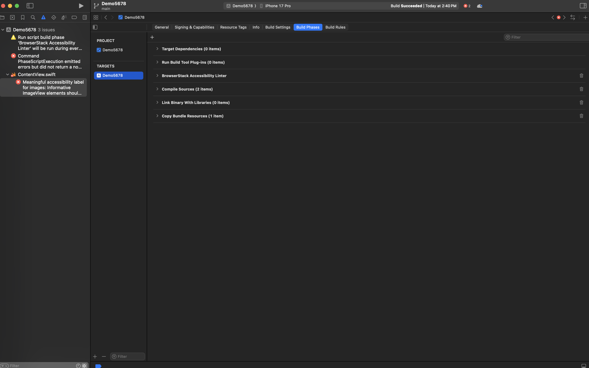
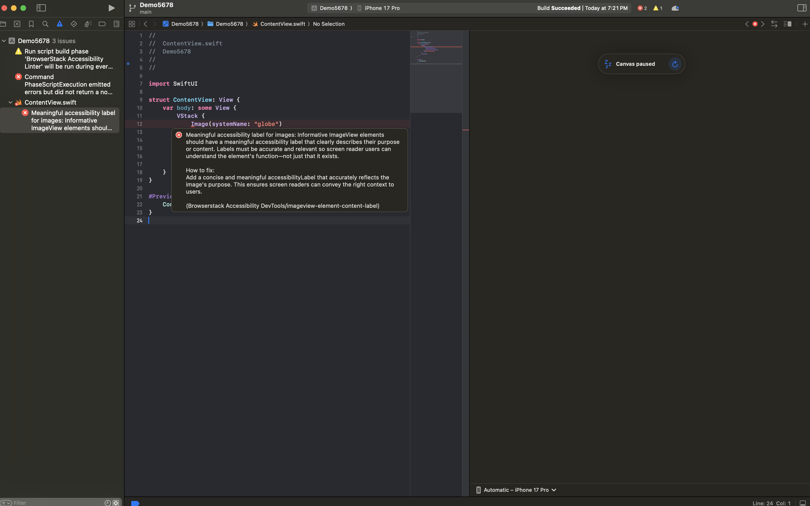
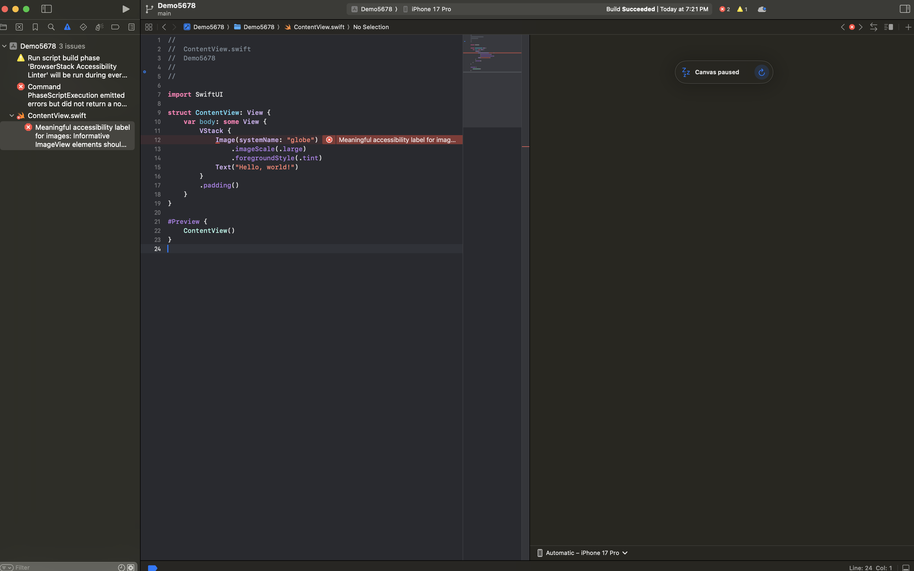

# AccessibilityDevTools
A Swift Package Manager (SPM) command plugin and CLI tool that scans your iOS Swift codebase for accessibility issues using BrowserStack’s Accessibility DevTools rule engine.

AccessibilityDevTools enables static accessibility linting directly inside Xcode, via SwiftPM, or using the standalone BrowserStack CLI, helping teams catch WCAG violations early—before UI tests, QA, or production.

---
## 🚀 Key Capabilities
* 🔍 **Automatic static accessibility linting** for SwiftUI
* 🛠 **10+ WCAG-aligned rules** from the Spectra rule engine
* 🛠 **Inline errors inside Xcode** with remediation guidance
* ⚡ **Runs during build** using the SPM command plugin

--
## Supported projects types
1. Projects created with Swift package manager
2. Projects created with XCode

---
## Authentication
1. Log in to your BrowserStack account or [sign up](https://www.browserstack.com/users/sign_in) if you don’t have an account.
2. Obtain your **Username** and **Access Key** from the [Account & Profile section](https://www.browserstack.com/accounts/profile/details) section on the dashboard.


3. Set the following environment variables using the **Username** and **Access Key** you obtained in step 2.
    * `BROWSERSTACK_USERNAME`
    * `BROWSERSTACK_ACCESS_KEY`
4. To set these variables, add the appropriate export commands to your shell configuration file:
    * **Zsh**: Add the following lines to your `~/.zshrc` file:
    ```zsh
    export BROWSERSTACK_USERNAME="<your-username>"
    export BROWSERSTACK_ACCESS_KEY="<your-access-key>"
    ```
    * **Bash**: Add the following lines to your `~/.bashrc` or `~/.bash_profile` file:
    ```bash
    export BROWSERSTACK_USERNAME="<your-username>"
    export BROWSERSTACK_ACCESS_KEY="<your-access-key>"
    ```
    * **Fish Shell**: Add the following lines to your ~/.config/fish/config.fish file:
    ```fish
    set -x BROWSERSTACK_USERNAME <your-username>
    set -x BROWSERSTACK_ACCESS_KEY <your-access-key>
    ```

---
## Installation
### 1. Projects created with XCode
> Note: XCode projects don’t have a Package.swift file. However, the script will manage this for you. If you prefer not to do this or face any issues, you can use our CLI for linting instead.

#### Clone Script
Run the following command at the <span style="color:red">root of your repository</span>

Zsh
```zsh
curl -L -o browserstack-a11y-scan-spm.sh "https://raw.githubusercontent.com/browserstack/AccessibilityDevTools/refs/heads/main/scripts/zsh/spm.sh" && chmod 0775 browserstack-a11y-scan-spm.sh
```

Bash
```bash
curl -L -o browserstack-a11y-scan-spm.sh "https://raw.githubusercontent.com/browserstack/AccessibilityDevTools/refs/heads/main/scripts/bash/spm.sh" && chmod 0775 browserstack-a11y-scan-spm.sh
```

Fish
```fish
curl -L -o browserstack-a11y-scan-spm.sh "https://raw.githubusercontent.com/browserstack/AccessibilityDevTools/refs/heads/main/scripts/fish/spm.sh" && chmod 0775 browserstack-a11y-scan-spm.sh
```

#### Add a Build Phase
Repeat these steps for each target in your project

1. Select a target from the targets left sidebar and go to Build Phases tab
2. Click + to create a new build phase. Name the newly created build phase to a name such as **BrowserStack Accessibility Linter**.

3. Drag this newly created build phase above **Compile Sources** step
4. Delete any existing code in the newly created build step and add the following code.
5. Add this script:
```
./browserstack-a11y-scan-spm.sh --include **/*.swift --non-strict
```
Xcode will now automatically run the accessibility scan during builds.

### 2. Projects created with Swift package manager
**Register plugin as dependency in your `Package.swift` file**
Edit the `Package.swift` to include following code. Specifically, add these two things:

* Add `AccessibilityDevTools` as a package under dependencies
* Add `a11y-scan` as a plugin under each target that you have in your project

```swift
let package = Package(
    name: "MyProject",
    // platforms, products, etc.    
    dependencies: [        
        // other dependencies        
        .package(
            url: "https://github.com/browserstack/AccessibilityDevTools.git",
            branch: "main"
        ),
    ],
    targets: [
        .executableTarget(            
            name: "MyApp",            
            dependencies: [],            
            plugins: [                
                .plugin(
                    name: "a11y-scan",
                    package: "AccessibilityDevTools"
                )            
            ]        
        )
    ]
)
```

**Add plugin in your `Package.swift`**

Edit the `Project.swift` to include following code. Specifically, these two things to be added

* Add `AccessibilityDevTools` as a package under dependencies

* Add `a11y-scan` as a plugin under each target that you have in your project

```swift
let package = Package(
    name: "MySPMProject",
    dependencies: [
        .package(url: "https://github.com/browserstack/AccessibilityDevTools.git", from: "1.0.0")
    ],
    targets: [
        .executableTarget(
            name: "MyApp",
            dependencies: [],
            plugins: [
                .plugin(name: "a11y-scan", package: "AccessibilityDevTools")
            ]
        )
    ]
)
```

#### Clone Script
Run the following command in the <span style="color:red;">root of your repository</span>

Zsh
```zsh
curl -L -o browserstack-a11y-scan-spm.sh "https://raw.githubusercontent.com/browserstack/AccessibilityDevTools/refs/heads/main/scripts/zsh/spm.sh" && chmod 0775 browserstack-a11y-scan-spm.sh
```

Bash
```bash
curl -L -o browserstack-a11y-scan-spm.sh "https://raw.githubusercontent.com/browserstack/AccessibilityDevTools/refs/heads/main/scripts/bash/spm.sh" && chmod 0775 browserstack-a11y-scan-spm.sh
```

Fish
```fish
curl -L -o browserstack-a11y-scan-spm.sh "https://raw.githubusercontent.com/browserstack/AccessibilityDevTools/refs/heads/main/scripts/fish/spm.sh" && chmod 0775 browserstack-a11y-scan-spm.sh
```

#### Add a Build Phase
Repeat these steps for each target in your project

1. Select a target from the targets left sidebar and go to Build Phases tab
2. Click + to create a new build phase. Name the newly created build phase to a name such as **BrowserStack Accessibility Linter**

3. Drag this newly created build phase above **Compile Sources** step
4. Delete any existing code in the newly created build step and add the following code.
5. Add this script:
```
./browserstack-a11y-scan-spm.sh --include **/*.swift --non-strict
```
Xcode will now automatically run the accessibility scan during builds.

---
## Running Accessibility Scans
Press Cmd + B to build the project. 
* If there are any Accessibility issues, then they will be show up in the Issue Navigator.

* The errors will also show up in the respective files, on the lines where the issue has occurred. Click on the cross mark to see the full error.

* If --non-strict flag is passed, the build will succeed even if there are Accessibility issues. If --non-strict flag is not passed, then the build will fail if there are Accessibility issues.

---
## Register pre-commit hook
You can run accessibility checks automatically before each commit by running the following command.
```bash
./browserstack-a11y-scan-spm.sh register-pre-commit-hook
```
You can then edit the `.git/hooks/pre-commit` file to customise the registered pre-commit hook.

---
## Support
For any issues or feedback, reach out to support@browserstack.com