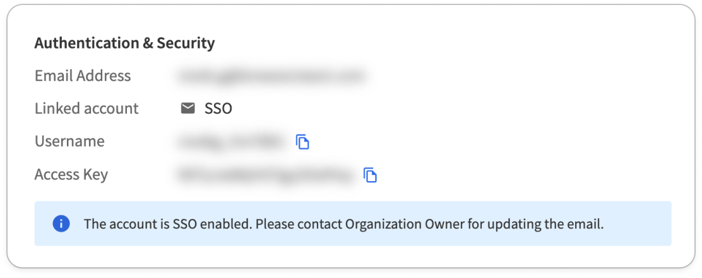
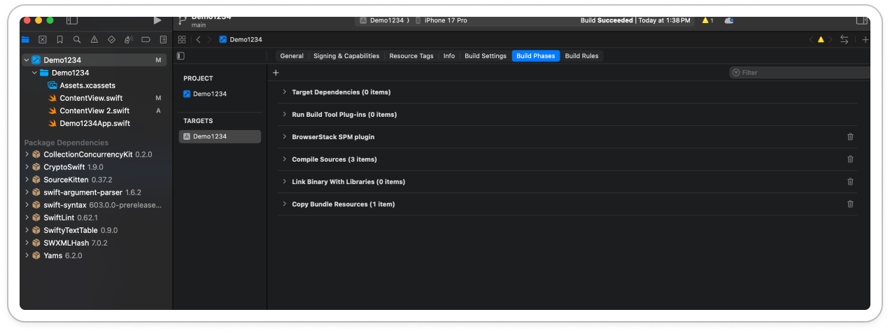
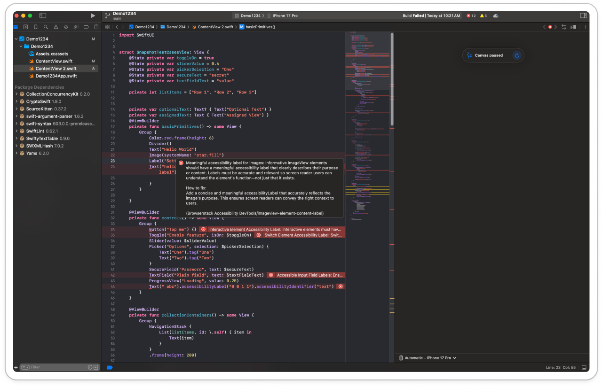
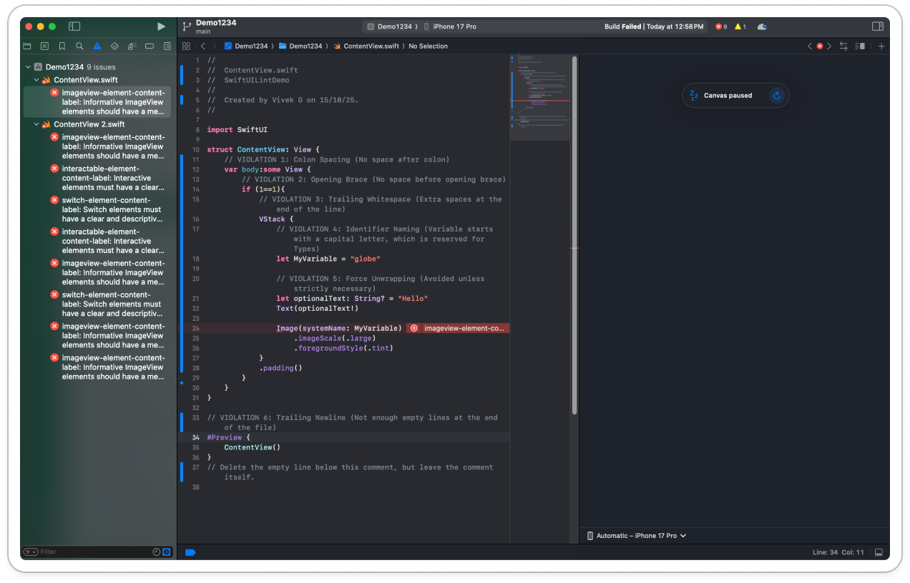

# AccessibilityDevTools
A Swift Package Manager (SPM) command plugin and CLI tool that scans your iOS Swift codebase for accessibility issues using BrowserStack’s Accessibility DevTools rule engine.

AccessibilityDevTools enables static accessibility linting directly inside Xcode, via SwiftPM, or using the standalone BrowserStack CLI, helping teams catch WCAG violations early—before UI tests, QA, or production.

---
## 🚀 Key Capabilities
* 🔍 **Automatic static accessibility linting** for SwiftUI
* 🛠 **10+ WCAG-aligned rules** from the Spectra rule engine
* 🛠 **Inline errors inside Xcode** with remediation guidance
* ⚡ **Runs during build** using the SPM command plugin

---
## Authentication
1. Log in to your BrowserStack account or [sign up](https://www.browserstack.com/users/sign_in) if you don’t have an account.
2. Obtain your **Username** and **Access Key** from the [Account & Profile section](https://www.browserstack.com/accounts/profile/details) section on the dashboard.


3. Set the following environment variables using the **Username** and **Access Key** you obtained in step 2.
    * `BROWSERSTACK_USERNAME`
    * `BROWSERSTACK_ACCESS_KEY`
4. To set these variables, add the appropriate export commands to your shell configuration file:
    * **Zsh**: Add the following lines to your `~/.zshrc` file:
    ```zsh
    export BROWSERSTACK_USERNAME="<your-username>"
    export BROWSERSTACK_ACCESS_KEY="<your-access-key>"
    ```
    * **Bash**: Add the following lines to your `~/.bashrc` or `~/.bash_profile` file:
    ```bash
    export BROWSERSTACK_USERNAME="<your-username>"
    export BROWSERSTACK_ACCESS_KEY="<your-access-key>"
    ```
    * **Fish Shell**: Add the following lines to your ~/.config/fish/config.fish file:
    ```fish
    set -x BROWSERSTACK_USERNAME <your-username>
    set -x BROWSERSTACK_ACCESS_KEY <your-access-key>
    ```

---
## Installation
### SwiftPM Projects
For SwiftPM projects, you can use the SPM `command plugin` for Accessibility DevTools.

**Add plugin in your `Package.swift`**

Edit the `Project.swift` to include following code. Specifically, these two things to be added

* Add `AccessibilityDevTools` as a package under dependencies

* Add `a11y-scan` as a plugin under each target that you have in your project

```swift
let package = Package(
    name: "MySPMProject",
    dependencies: [
        .package(url: "https://github.com/browserstack/AccessibilityDevTools.git", from: "1.0.0")
    ],
    targets: [
        .executableTarget(
            name: "MyApp",
            dependencies: [],
            plugins: [
                .plugin(name: "a11y-scan", package: "AccessibilityDevTools")
            ]
        )
    ]
)
```
**Add a Build Phase to run the plugin**
1. Select first item (project root) in the left folder tree and go to Build Phases tab

2. Click + to create a new build phase. Name the newly created build phase to a name such as **BrowserStack Accessibility Linter**
3. Drag this newly created build phase above **Compile Sources** step
4. Delete any existing code in the newly created build step and add the following code. 
5. Add this script:
```bash
/usr/bin/xcrun swift package scan --disable-sandbox --include **/*.swift
```

Xcode will now automatically run the accessibility scan during builds.

### Non-SwiftPM Projects
For all non-SwiftPM projects (e.g. Xcode projects), you can use the **browserstack-cli**

**Install CLI in the project repo**
1. Open terminal and navigate to the project folder.
2. Run the commands provided in the [documentation](https://www.browserstack.com/docs/accessibility-dev-tools/run-checks-cli#install-the-cli)

**Disable Sandboxing**
1. In Xcode project, select first item (project root) in the left folder tree and go to Build Settings tab
2. Search for sandbox > Set user script sandboxing to “NO”

**Add a Build Phase to run the plugin**
1. Select first item (project root) in the left folder tree and go to Build Phases tab

2. Click + to create a new build phase. Name the newly created build phase to a name such as **BrowserStack Accessibility Linter**
3. Drag this newly created build phase above **Compile Sources** step
4. Delete any existing code in the newly created build step and add the following code. 
5. Add this script:
```bash
./browserstack-cli accessibility --include **/*.swift
```

---
## Running Accessibility Scans
Press Cmd + B to build the project. If there are no errors from the linter (and any other build steps you have), the build will succeed.

If issues are found:

* Inline red markers show errors in files. Click on the cross mark to see the full error.

* All issues appear in the **Issue Navigator**


---
## Support
For any issues or feedback, reach out to support@browserstack.com